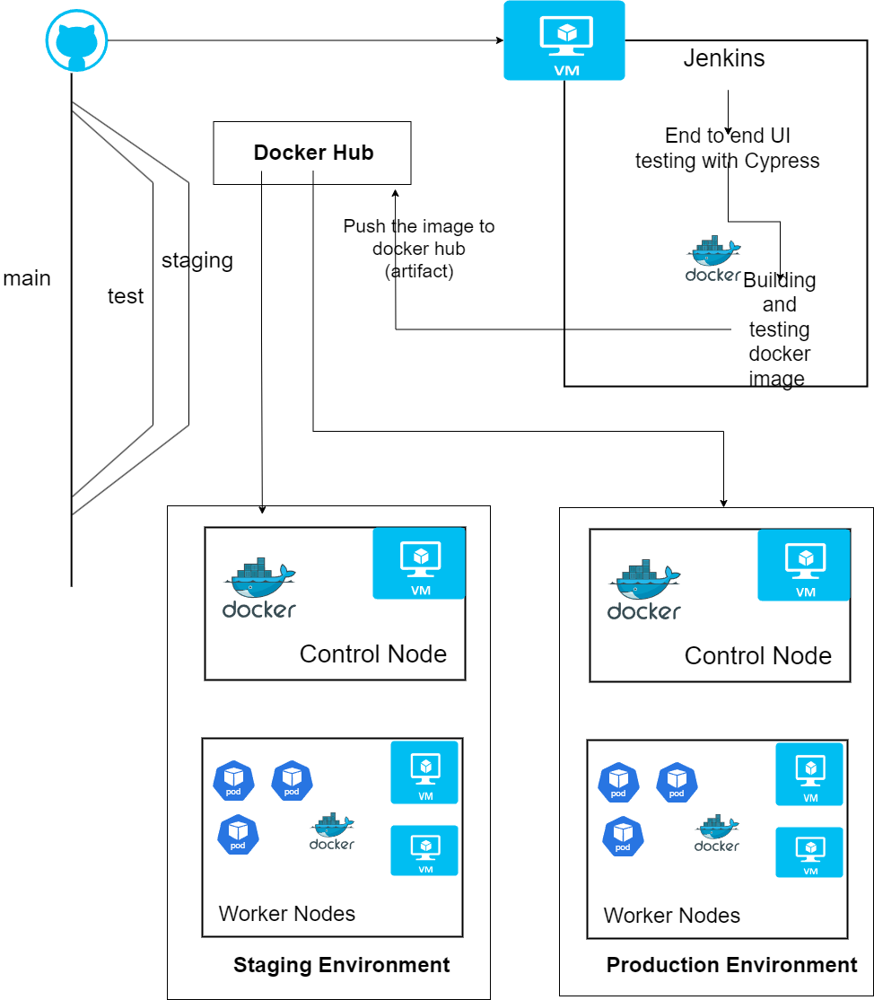

# 🚀 Full-Stack DevOps Pipeline: Next.js Deployment using Jenkins, Docker & Kubernetes

This project implements a full CI/CD pipeline for a **Next.js web application**, leveraging DevOps tools and best practices to streamline automated testing, containerization, and deployment across development, staging, and production environments.

---

## 📁 Project Structure

- **Frontend Framework:** Next.js  
- **CI/CD:** Jenkins  
- **Containerization:** Docker  
- **Orchestration:** Kubernetes (K3s)  
- **Testing:** Cypress  
- **VM Provisioning:** Vagrant  
- **Source Control:** Git, GitHub  

---

## 📌 Objective

Automate the build, test, and deployment of a modern web application using a full DevOps toolchain. The goal is to ensure rapid, consistent, and error-resistant deployments in development, staging, and production environments.

---

## 🔧 Tools Used

| Tool        | Purpose                                |
|-------------|----------------------------------------|
| Vagrant     | Provision Jenkins, staging & prod VMs  |
| Jenkins     | Automate CI/CD pipelines               |
| Docker      | Build and run containers               |
| Kubernetes  | Deploy containers across nodes         |
| Cypress     | End-to-end testing                     |
| GitHub      | Code hosting & webhook source          |
| Ngrok       | Expose Jenkins for webhook triggers    |

---

## 🧱 Architecture Overview

Three primary environments:

1. **Development** (Test pipeline)  
2. **Staging** (3-node Kubernetes cluster via Vagrant)  
3. **Production** (3-node Kubernetes cluster)

Each environment is provisioned using Vagrant. Scripts:  
👉 [Vagrant Setup Repo](https://github.com/sanjeebnepal/Vagrant-script-jenkinsdockerkubernetes.git)

### 📊 Deployment Architecture Diagram

---

## 🔄 CI/CD Pipeline Workflow

### ✅ Test Pipeline (Development)
- Triggered by GitHub webhook  
- Runs Cypress tests  
- Builds Docker image  
- Tests locally with `curl`  
- Pushes to Docker Hub  
- Triggers **Staging Pipeline**

### 🧪 Staging Pipeline
- Deploys image to K3s Kubernetes cluster  
- Jenkins connects via SSH to 3 VMs  
- Verifies deployment on NodePort `31000`

### 🚢 Production Pipeline
- Mirrors staging environment setup  
- Deploys tested Docker image to 3 VMs  
- Final verification on production NodePort `31000`

---

## 🔐 Integration Details

- **SSH Keys:** For secure GitHub and VM access  
- **Credentials Manager:** Stores DockerHub login & SSH private keys  
- **Ngrok:** Tunnels Jenkins for GitHub webhook communication  

---

## 🧠 Lessons Learned

- Full CI/CD implementation from scratch  
- Containerization and orchestration at scale  
- Complex Jenkinsfile logic and SSH automation  
- Real-world issues like port conflicts, deployment race conditions  

---

## ✅ Future Improvements

- Add monitoring with Prometheus/Grafana  
- Centralized logging with ELK Stack  
- Use GitOps (ArgoCD or Flux)  
- Add rollback strategies and blue-green deployments  

---

## 📜 License

This project was developed for educational purposes under the **DevOps for Cloud Computing** course at Lambton College.
